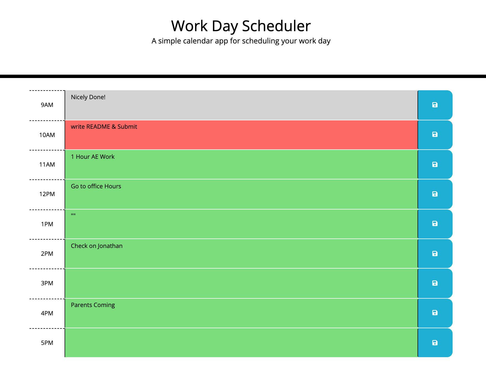

# DailyPlanner
### Live site at [DailyPlanner](https://cgsdesign.github.io/DailyPlanner/)
​
For this project I created a daily planner with editable hourly time slots that can be saved to local storage. The page utilizes Minute-JS, jQuery, jQuery-UI and Bootstrap as well as vanilla JS, CSS, and HTML. 
​
## Key Features
* Rewritable hourly task blocks 
* Local Storage utilized for task retention
* Various JS Libraries utilized
* Task time slots color coded based on relation to current time
* Task colors auto-refresh every 5 minutes
* Clear JS code organized by function and noted with internal documentation for easy reproducibility

## Credits
​
* Base code curtasy of uwisconsin_coding_bootcamp
* Minutes-JS, J-Query, J-Query-UI, and Bootstrap - thank you for your open source code.
​
## Licence 

@@ -41,4 +41,3 @@ THE SOFTWARE IS PROVIDED "AS IS", WITHOUT WARRANTY OF ANY KIND, EXPRESS OR IMPLICIT FITNESS FOR A PARTICULAR PURPOSE AND NONINFRINGEMENT. IN NO EVENT SHALL THE AUTHORS OR COPYRIGHT HOLDERS BE LIABLE FOR ANY CLAIM, DAMAGES OR OTHER LIABILITY, WHETHER IN AN ACTION OF CONTRACT, TORT OR OTHERWISE, ARISING FROM, OUT OF OR IN CONNECTION WITH THE SOFTWARE OR THE USE OR OTHER DEALINGS IN THE SOFTWARE.
